# VPN Site-to-Site IPsec entre un FortiGate y un router Cisco

## 🎥 Video demostrativo

**[Ver video en YouTube](https://www.youtube.com/watch?v=kWzByNlrA3g)**

> Autor: **Erick Abdiel Laureano Martinez** | Matrícula: **2025-0846** | Asignatura: Seguridad de Redes

---

## Tabla de contenido
1. [Propósito del laboratorio](#propósito-del-laboratorio)
2. [Diagrama de la topología](#diagrama-de-la-topología)
3. [Direccionamiento IP](#direccionamiento-ip)
4. [Configuración de red del FortiGate](#configuración-de-red-del-fortigate)
5. [Configuración de red del Cisco](#configuración-de-red-del-cisco)
6. [VPN Site-to-Site IPsec](#vpn-site-to-site-ipsec)
7. [NAT y políticas de firewall](#nat-y-políticas-de-firewall)
8. [Usuarios: VLAN 10, DHCP y traceroute](#usuarios-vlan-10-dhcp-y-traceroute)
9. [Servidor web HTTPS](#servidor-web-https)
10. [Comprobación: la comunicación solo fluye con la VPN activa](#comprobación-la-comunicación-solo-fluye-con-la-vpn-activa)
11. [Evidencias y logs](#evidencias-y-logs)
12. [Running-configs y scripts](#running-configs-y-scripts)

---

## Propósito del laboratorio

Comunicar a un usuario conectado a un router Cisco con un servidor web protegido por un FortiGate **a través de un túnel IPsec site-to-site entre ambos equipos (peers)** y demostrar que **la comunicación solo fluye si el enlace VPN está activo**. La configuración y la demostración del FortiGate se hacen por la GUI.

| Requisito | Cómo se cumple |
|---|---|
| 1 FortiGate: red, NAT y VPN | Forti-1 con túnel `VPN_TO_CISCO`, rutas y política NAT hacia el ISP |
| 1 equipo de red (Cisco): red, NAT y VPN | Cisco-User con ISAKMP/IPsec, crypto map y NAT overload |
| ISP con IPs públicas | Cloud1 de GNS3 como ISP (red 200.8.46.0/24, gateway 200.8.46.2) |
| Servidor web /28 con HTTPS | 10.8.46.128/28, Apache con SSL |
| Usuarios /25 en VLAN 10 con DHCP | 10.8.46.0/25, DHCP del Cisco en la subinterfaz Fa0/0.10 |
| Traceroute al servidor | Pasa por el túnel IPsec |

---

## Diagrama de la topología

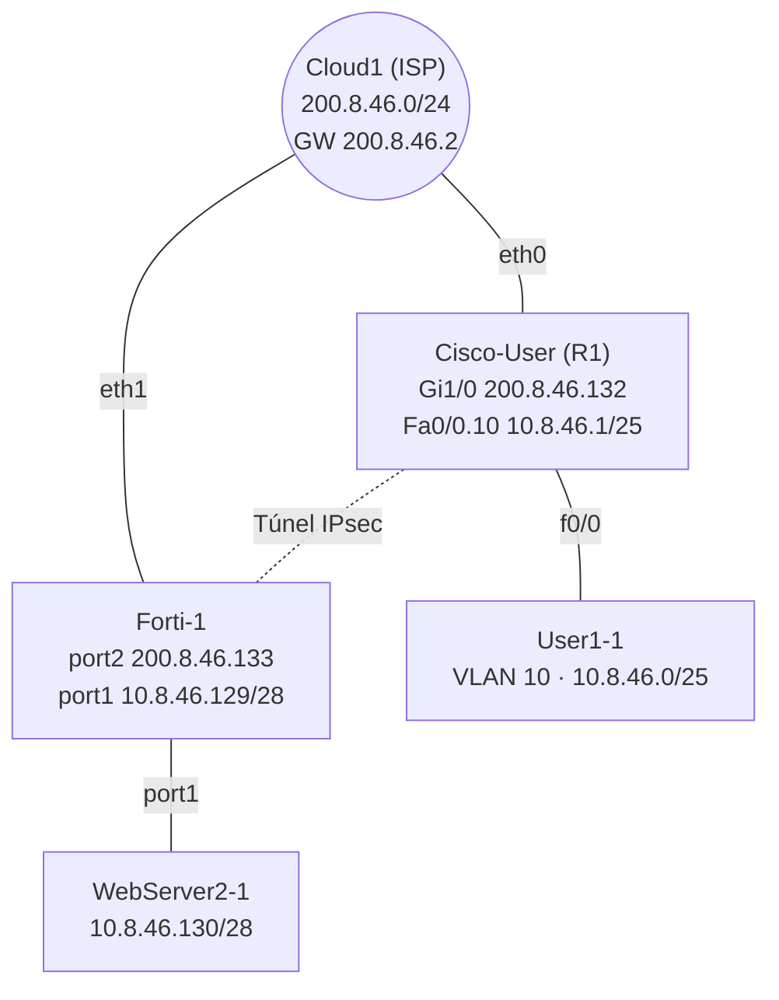

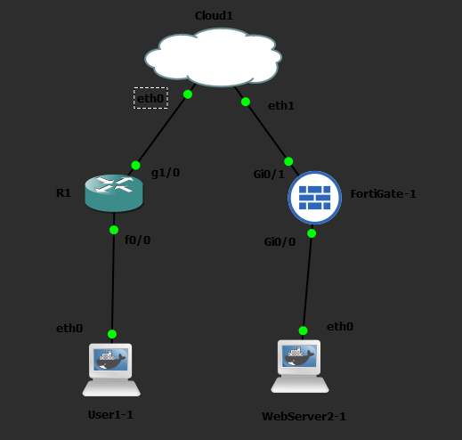

---

## Direccionamiento IP

| Dispositivo | Interfaz | Dirección | Notas |
|---|---|---|---|
| Cisco-User | Gi1/0 | 200.8.46.132/24 | WAN al ISP, peer de la VPN |
| Cisco-User | Fa0/0.10 | 10.8.46.1/25 | Gateway y servidor DHCP de la VLAN 10 |
| Forti-1 | port2 (WAN) | 200.8.46.133/24 | Peer de la VPN |
| Forti-1 | port1 (LAN) | 10.8.46.129/28 | Gateway del servidor |
| Servidor web | eth0 | 10.8.46.130/28 | Apache HTTPS |
| Usuario | eth0.10 | DHCP (10.8.46.10 - 10.8.46.126) | VLAN 10 |
| ISP | gateway | 200.8.46.2 | Gateway por defecto de ambos peers |

---

## Configuración de red del FortiGate

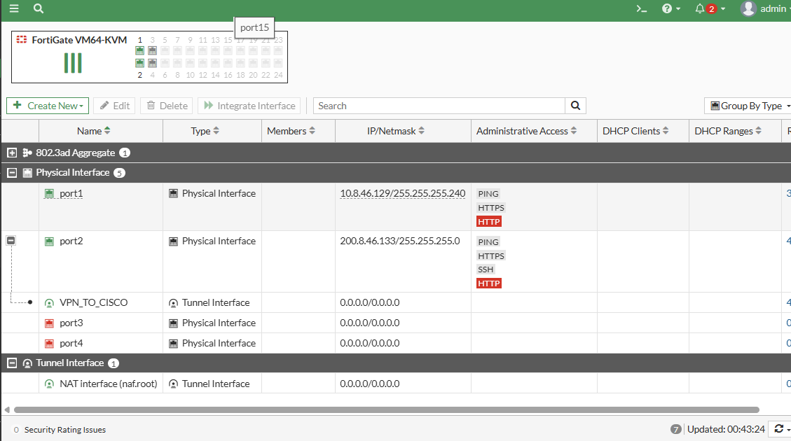

Rutas estáticas: la ruta por defecto hacia el ISP (200.8.46.2) y `10.8.46.0/25` por el túnel `VPN_TO_CISCO`.

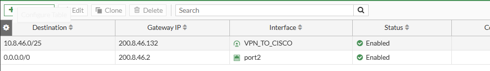

---

## Configuración de red del Cisco

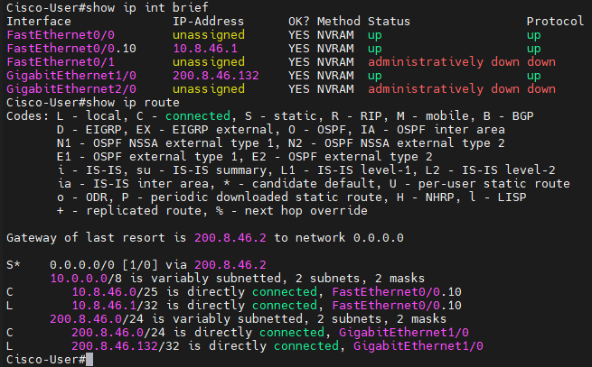

Servidor DHCP de la VLAN 10 (pool `POOL_VLAN10`):

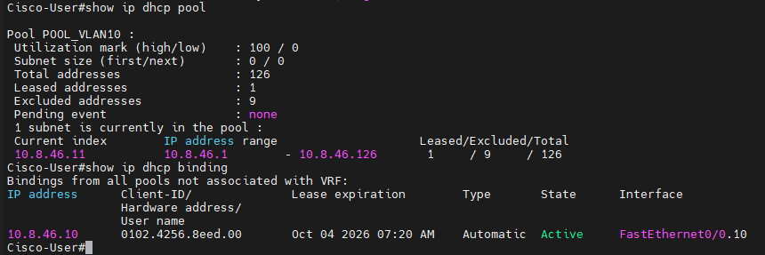

---

## VPN Site-to-Site IPsec

| Parámetro | FortiGate (`VPN_TO_CISCO`) | Cisco |
|---|---|---|
| Peer | 200.8.46.132 | 200.8.46.133 |
| Autenticación | Clave precompartida | Clave precompartida |
| Fase 1 | DES + SHA256, DH grupo 14 | `isakmp policy 10`: SHA256, DH 14 |
| Fase 2 | DES + SHA256, PFS desactivado | `TS-VPN`: `esp-des esp-sha256-hmac` |
| Tráfico protegido | 10.8.46.128/28 ↔ 10.8.46.0/25 | `ACL-VPN` |

> **Nota:** se usa DES porque la licencia de evaluación del FortiGate no permite algoritmos más fuertes.

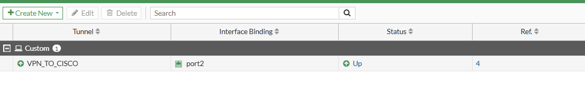

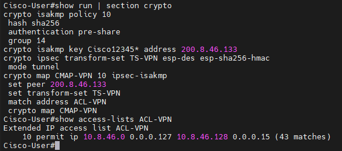

Túnel activo en ambos extremos:

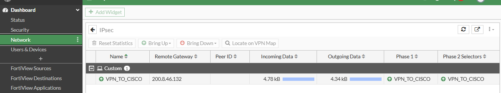

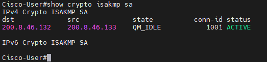

---

## NAT y políticas de firewall

**FortiGate**
- `VPN_OUT_USERS`: port1 → VPN_TO_CISCO.
- `VPN_IN_USERS`: VPN_TO_CISCO → port1.
- `NAT_SERVER_INTERNET`: port1 → port2 con **NAT** activado.

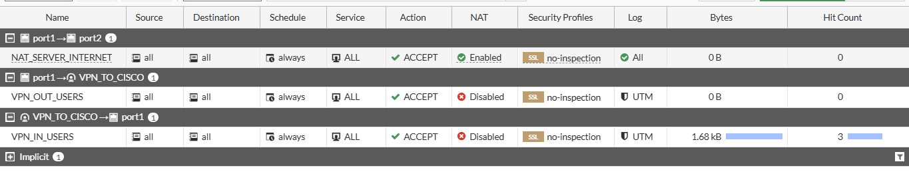

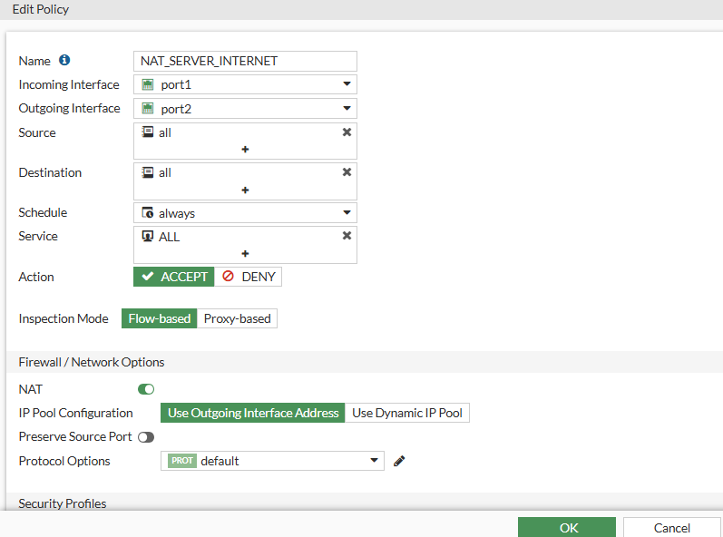

**Cisco:** NAT overload de la VLAN 10 por Gi1/0 (`NAT-USERS`), excluyendo el tráfico hacia el servidor para que viaje por el túnel.

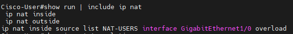

---

## Usuarios: VLAN 10, DHCP y traceroute

El cliente etiqueta la VLAN 10 (`eth0.10`) y recibe su IP del DHCP del Cisco.

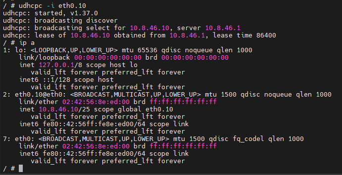

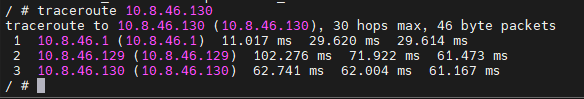

---

## Servidor web HTTPS

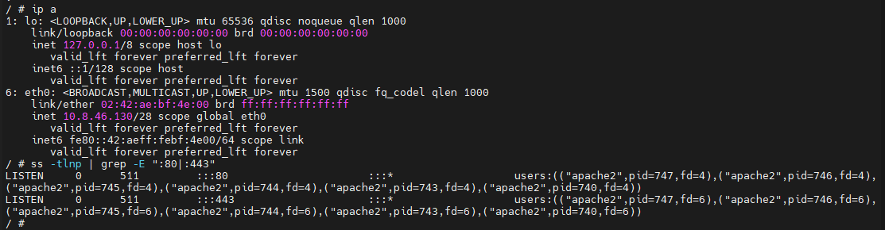

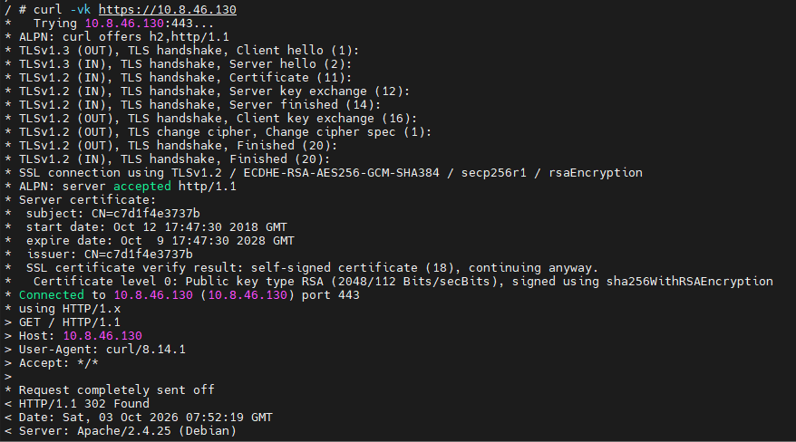

---

## Comprobación: la comunicación solo fluye con la VPN activa

1. VPN activa: ping, traceroute y HTTPS responden.
2. Se desactiva la política `VPN_IN_USERS` en el FortiGate: el ping da 100 % de pérdida y `curl` falla por tiempo de espera.
3. Se reactiva la política y la comunicación se restablece.

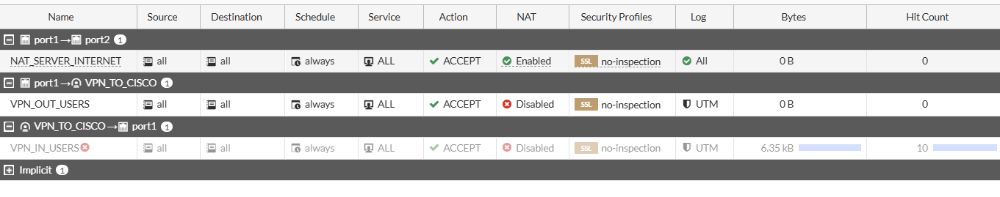

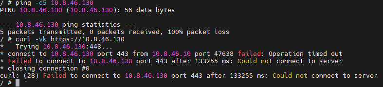

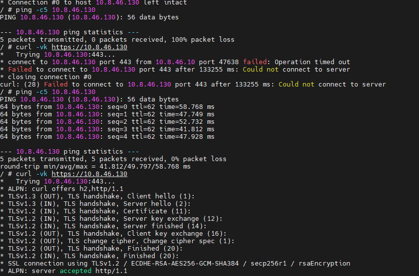

---

## Evidencias y logs

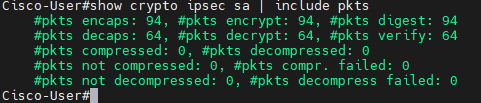

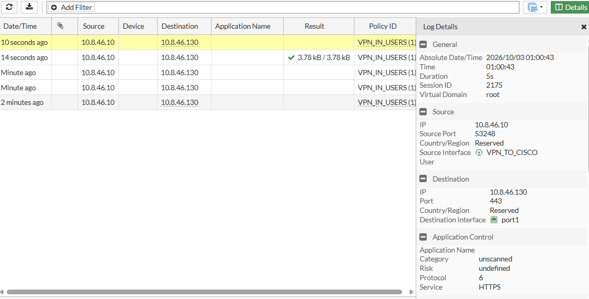

---

## Running-configs y scripts

```
├── README.md
├── configs/
│   ├── forti1-running-config.conf
│   └── cisco-user-running-config.txt
├── scripts/
│   ├── cisco-ipsec-nat.txt     # ISAKMP, IPsec, crypto map y NAT del Cisco
│   ├── usuarios-dhcp.sh        # VLAN 10 + DHCP en el cliente
│   ├── webserver-network.txt   # IP fija del contenedor (Edit config de GNS3)
│   ├── webserver-https.sh      # Apache con SSL
│   └── pruebas-usuario.sh      # Ping, traceroute y HTTPS
└── img/
```

- [Forti-1](configs/forti1-running-config.conf) · [Cisco-User](configs/cisco-user-running-config.txt)
- [Scripts](scripts/)
